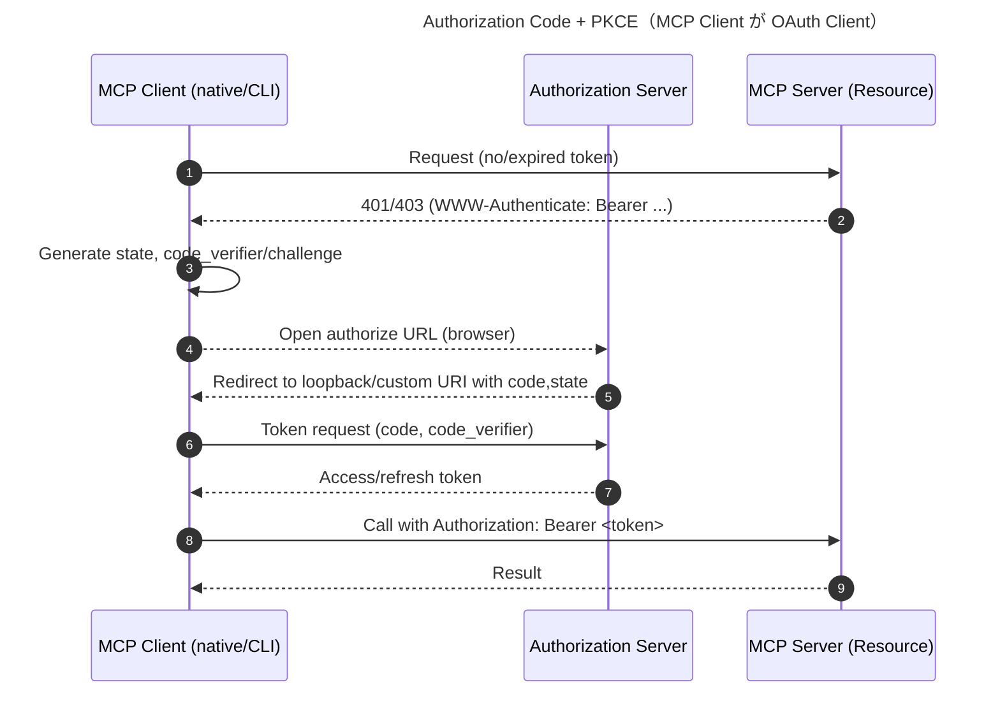
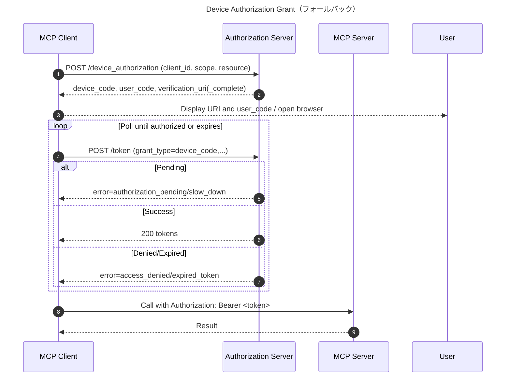

# MCP Authorization — Authorization Code Flow

前提: 本評価は MCP の HTTP/WS トランスポートを対象に、OAuth 2.0（Authorization Code + PKCE）前提で整理しています。

前提
- MCP Server は OAuth 2.0 の観点では「保護リソース（Resource Server）」として振る舞い、RFC 9728（Protected Resource Metadata）を公開して認可サーバの場所を示す必要がある。
- MCP Client は OAuth 2.0 の「クライアント（OAuth Client）」として振る舞い、認可サーバからアクセストークンを取得して MCP Server（保護リソース）へ提示する。
- 本ドキュメントは、MCP Server が HTTP Transport を用いる前提で、MCP Client が Authorization Code Grant を用いる妥当性を評価する。

## 結論
- 利用可能: Authorization Code + PKCE は、ネイティブ/デスクトップ/CLI に分類される MCP Client がユーザーの同意を得てトークンを取得し、MCP Server にアクセスする用途に適している（RFC 8252 に準拠）。
- 手動コピー方式: ループバック URI にリダイレクトさせ、ローカルでリスナーは起動せず、ブラウザのアドレスバーに表示されたフル callback URL をユーザーが CLI に貼り付ける運用も可能（推奨ではないが実装可）。
- 任意: Device Authorization Grant は MCP として必須ではないため、環境/UX 要件に応じて省略可能（必要ならオプションとして実装）。

## 必要条件（MUST/SHOULD）
- MCP Client（OAuth Client）
  - MUST: PKCE（S256）を使用（RFC 7636）。
  - MUST: `state` を用いて CSRF を防止。OIDC 併用時は `nonce` 推奨。
  - MUST: リダイレクト URI はネイティブ向け推奨（RFC 8252）に従う（ループバック 127.0.0.1:random、カスタムスキーム等）。
  - SHOULD: トークン取得時に RFC 8707 の `resource` を指定し、MCP Server 宛にスコープされたトークンを要求。
  - SHOULD: RFC 8414 で AS メタデータを解決。
- MCP Server（Resource Server）
  - MUST: RFC 9728 を実装・公開し、AS の場所を示す（`/.well-known/oauth-protected-resource`）。
  - MUST: 提示されたトークンが当該リソース宛であることを検証（`aud`/`resource`）。
  - SHOULD: Bearer トークン運用/チャレンジは RFC 6750 に準拠。
- Authorization Server（参考）
  - MUST: RFC 8414 のメタデータを提供。

## 典型フロー（MCP Client が Authorization Code + PKCE を使用）
1) MCP Client → MCP Server: 保護リソースへの操作を試行（トークン未所持）。
2) MCP Client: `code_verifier`/`code_challenge`/`state` を生成し、認可リクエスト URL を構成。
3) MCP Client: 既定ブラウザで認可 URL を開く（手動コピー方式の場合は後述参照）。
4) User ↔ Authorization Server: 認証/同意。
5) Authorization Server → MCP Client: ループバック/カスタムスキームの `redirect_uri` へ `code` と `state` をリダイレクト（手動コピー方式ではローカルで受信せず、ブラウザのアドレスバーに表示された URL をコピー）。
6) MCP Client → Authorization Server: トークンエンドポイントで `code_verifier` と引き換えにトークン取得。
7) MCP Client → MCP Server: `Authorization: Bearer <access_token>` を付与して API 呼び出し。
8) MCP Server: トークンの検証（署名/期限/`aud`/`resource`）後に処理。



## 補足（MCP Server が外部 API にアクセスする場合）
- 上記とは別件として、MCP Server 自身が第三者 API にアクセスする必要があるなら、MCP Server が「その外部 API に対する」OAuth Client になる（MCP Authorization の必須要件ではない）。
- この場合はサーバ側リダイレクト（機密クライアント）で Authorization Code + PKCE を使うか、目的に応じて他のグラント（Client Credentials など）を選ぶ。

## 参考
- RFC 6749（OAuth 2.0）/ RFC 6750（Bearer）/ RFC 7636（PKCE）/ RFC 8414（AS Metadata）/ RFC 8707（Resource Indicators）/ RFC 7591・7592（DCR）/ RFC 9728（Protected Resource Metadata）/ RFC 8252（Native Apps）

## 付録: Authorization Code + PKCE のHTTPメッセージ例（ステップ2–6）

前提（例示値）
- AS: `https://auth.example.com`
- authorize_endpoint: `https://auth.example.com/oauth2/authorize`
- token_endpoint: `https://auth.example.com/oauth2/token`
- client_id: `mcp-cli-12345`（公開クライアント）
- redirect_uri: `http://127.0.0.1:53219/callback`（ループバック; RFC 8252）
- scope: `openid profile offline_access mcp.read mcp.write`
- resource: `https://mcp.example.com`（MCP Server のリソース識別子）
- state: `af0f5f...`（十分にランダム）
- code_verifier: `bF2Yh8mS6v0yYf4p2dFhN0Lz1yN6zK8hT4KpW3Q9XrU`（43–128 文字）
- code_challenge (S256): `3YVqz3pG2mO8c1t8...`（BASE64URL(SHA256(code_verifier))）

ステップ2: PKCE 準備（擬似手順）
- `code_verifier` を生成（強乱数 32–64 バイト → base64url（パディングなし））。
- `code_challenge = BASE64URL(SHA256(code_verifier))` を計算。
- 十分にランダムな `state` を生成。
- `state` と `code_verifier` をステップ6まで安全に保持。

ステップ3: 認可リクエスト（ブラウザ GET）
開くURL（一行）:
```
https://auth.example.com/oauth2/authorize?response_type=code&client_id=mcp-cli-12345&redirect_uri=http%3A%2F%2F127.0.0.1%3A53219%2Fcallback&scope=openid%20profile%20offline_access%20mcp.read%20mcp.write&state=af0f5f...&code_challenge=3YVqz3pG2mO8c1t8...&code_challenge_method=S256&resource=https%3A%2F%2Fmcp.example.com
```
HTTP 表現（概念）:
```
GET /oauth2/authorize?response_type=code&client_id=mcp-cli-12345&redirect_uri=http%3A%2F%2F127.0.0.1%3A53219%2Fcallback&scope=openid%20profile%20offline_access%20mcp.read%20mcp.write&state=af0f5f...&code_challenge=3YVqz3pG2mO8c1t8...&code_challenge_method=S256&resource=https%3A%2F%2Fmcp.example.com HTTP/1.1
Host: auth.example.com
Accept: text/html,application/xhtml+xml
```

（ユーザーがログイン/同意後）

ステップ5: リダイレクト（AS → ループバック）
```
HTTP/1.1 302 Found
Location: http://127.0.0.1:53219/callback?code=SplxlOBeZQQYbYS6WxSbIA&state=af0f5f...
```
クライアントは `state` が一致することを確認してから続行。

ステップ6: トークンエクスチェンジ（クライアント → AS）
```
POST /oauth2/token HTTP/1.1
Host: auth.example.com
Content-Type: application/x-www-form-urlencoded
Accept: application/json

grant_type=authorization_code&
code=SplxlOBeZQQYbYS6WxSbIA&
redirect_uri=http%3A%2F%2F127.0.0.1%3A53219%2Fcallback&
client_id=mcp-cli-12345&
code_verifier=bF2Yh8mS6v0yYf4p2dFhN0Lz1yN6zK8hT4KpW3Q9XrU&
resource=https%3A%2F%2Fmcp.example.com
```

成功レスポンス:
```
HTTP/1.1 200 OK
Content-Type: application/json

{
  "access_token": "eyJhbGciOiJSUzI1NiIsInR5cCI6IkpXVCJ9....",
  "token_type": "Bearer",
  "expires_in": 3600,
  "refresh_token": "def50200a3f7...",
  "scope": "openid profile offline_access mcp.read mcp.write"
}
```

注意事項
- `resource`（RFC 8707）は認可リクエストとトークンリクエストの両方に含めることが望ましい（AS 実装に依存）。
- ネイティブ/CLI は公開クライアントとして `client_secret` を使わない。PKCE と `state` で保護する。
- 受領トークンの `aud`/`azp`/`resource` 等を検証し、MCP Server 向けであることを確認。

## 手動コピー方式（ループバック受信なし）の運用

- 手順（概要）
  1) クライアントは通常どおり `state`/PKCE を準備し、`redirect_uri` にループバック（例: `http://127.0.0.1:{random}/callback`）を指定して認可 URL をブラウザで開く。
  2) 認証/同意後、AS はその `redirect_uri` に `code` と `state` を付けてリダイレクトするが、ローカルで受信していないためブラウザは接続エラーを表示する。
  3) ユーザーはアドレスバーに表示されたフル URL（`http://127.0.0.1:{port}/callback?code=...&state=...`）を CLI に貼り付ける。
  4) クライアントは貼り付けられた URL から `code`/`state` を抽出し、`state` を検証した上でトークン交換を実施する。
- セキュリティ留意点
  - MUST: `state` 検証と PKCE（S256）。
  - SHOULD: 認可コードの TTL を短く設定（60–120 秒）し単回使用を強制。
  - SHOULD: ブラウザの画面に「この URL 全体をコピーしてください」と明示。パラメータの順序やエンコードを崩さないよう注意喚起。
  - 注意: 認可コードがブラウザ履歴に残るため、共有画面/スクリーンショット等に配慮。

## 用語と実装補足（Loopback / Custom Scheme）

- Loopback Redirect URI（推奨; RFC 8252）
  - 例: `http://127.0.0.1:{random_port}/callback` または `http://[::1]:{random_port}/callback`
  - クライアントは一時的なローカル HTTP リスナーを 127.0.0.1（または ::1）で起動し、認可コード受領後に停止する。
  - RFC 8252 に従い、AS はループバック URI での「ポート可変」を許容すべき（MUST allow variable port）。パスは厳密一致が推奨。
  - 実装手順（推奨）:
    1) 未使用の高位ポートを確保し、127.0.0.1（または ::1）にバインドしてリスナーを起動。
    2) その `redirect_uri` を用いてブラウザで authorize エンドポイントを開く。
    3) `GET /callback?code=...&state=...` を受領し、`state` 検証後にブラウザへ簡易の完了画面を返す。
    4) リスナーを速やかに停止。
  - 注意: `localhost` は環境により外部解決される恐れがあるため、IP リテラル（127.0.0.1 / ::1）が推奨。`0.0.0.0` での待受けは避ける。

- Custom Scheme Redirect URI（代替）
  - 例: `myapp://oauth2redirect`
  - OS に独自スキームを登録してブラウザからアプリを呼び戻す方式。ローカル HTTP リスナーは不要。
  - 衝突/乗っ取り防止のため固有のスキーム名（リバースドメイン等）を使用。AS には正確な URI を登録（ワイルドカード不可）。

### Q&A: Loopback を使う場合、ポートをリッスンする必要がある？

- はい。Loopback 方式では MCP Client（ネイティブ/CLI）が一時的にローカル HTTP ポートをリッスンし、AS からのリダイレクト（`code`/`state`）を受け取る必要があります。これは RFC 8252 の推奨手法で、クライアントはランダムな高位ポートを選び、受領直後にクローズします。
- 一方、Custom Scheme 方式では OS の URI ハンドラで受け取るため、ローカル HTTP リスナーは不要です。

### Q&A: Claude Code CLI / Codex CLI は loopback リッスンを想定している？

- 一律の期待はできません。CLI クライアントは実装により次のいずれか（または複数）を採用します。
  - Loopback（RFC 8252）: 可能な環境では一時的に 127.0.0.1 の高位ポートをリッスンして受け取る。
  - Device Authorization（RFC 8628）: ブラウザが使えない/ポート確保が難しい環境での定番。CLI にコード表示→ユーザーが別デバイス/ブラウザで認証。
  - Custom Scheme: デスクトップ/GUI では選択肢だが、CLI では導入負荷が高め。
- したがって、Claude Code CLI や Codex CLI が「必ず」loopback をリッスンする前提にはできません。プロダクトの実装/設定を確認し、少なくとも Device Authorization をフォールバックとして用意するのが安全です。

## オプション: Device Authorization Grant（RFC 8628）

Authorization Code + PKCE が使えない（ブラウザが開けない、ループバックポートが確保できない、企業端末の制約が厳しい等）環境でのみ採用を検討する任意機能です（MCP としては必須ではありません）。以下は参考の実装観点と具体的 HTTP 例です。

- 役割前提: MCP Client が OAuth クライアント。MCP Server は保護リソース。
- 事前発見: RFC 8414 のメタデータから `device_authorization_endpoint` と `token_endpoint` を解決（AS 実装に依存。無い場合はプロバイダ非対応）。
- リソース指定: RFC 8707 の `resource` で MCP Server を指定（可能な AS なら推奨）。

手順（概要）
1) デバイス認可リクエスト（クライアント→AS）
2) ユーザーが別ブラウザで `verification_uri` にアクセスし、`user_code` を入力（または `verification_uri_complete` を開く）
3) トークンポーリング（クライアント→AS）。`authorization_pending` や `slow_down` を扱いながら、成功時にトークン受領
4) 取得トークンで MCP Server にアクセス

HTTP 例（サンプル値は前節に準拠）

ステップ1: デバイス認可リクエスト
```
POST /oauth2/device_authorization HTTP/1.1
Host: auth.example.com
Content-Type: application/x-www-form-urlencoded
Accept: application/json

client_id=mcp-cli-12345&
scope=openid%20profile%20offline_access%20mcp.read%20mcp.write&
resource=https%3A%2F%2Fmcp.example.com
```

成功レスポンス
```
HTTP/1.1 200 OK
Content-Type: application/json

{
  "device_code": "GmRhmhcxhwAzkoEqiMEg_DnyEysNkuNhszIySk9eS",
  "user_code": "WDJB-MJHT",
  "verification_uri": "https://auth.example.com/device",
  "verification_uri_complete": "https://auth.example.com/device?user_code=WDJB-MJHT",
  "expires_in": 900,
  "interval": 5
}
```

ステップ3: トークンポーリング（エラー処理を含む）
```
POST /oauth2/token HTTP/1.1
Host: auth.example.com
Content-Type: application/x-www-form-urlencoded
Accept: application/json

grant_type=urn:ietf:params:oauth:grant-type:device_code&
device_code=GmRhmhcxhwAzkoEqiMEg_DnyEysNkuNhszIySk9eS&
client_id=mcp-cli-12345&
resource=https%3A%2F%2Fmcp.example.com
```

ポーリング中の代表的なエラー（HTTP 400 / JSON）
```
{ "error": "authorization_pending" }
{ "error": "slow_down" }
{ "error": "access_denied" }
{ "error": "expired_token" }
```

成功レスポンス（例）
```
HTTP/1.1 200 OK
Content-Type: application/json

{
  "access_token": "eyJhbGciOiJSUzI1NiIsInR5cCI6IkpXVCJ9....",
  "token_type": "Bearer",
  "expires_in": 3600,
  "refresh_token": "def50200a3f7...",
  "scope": "openid profile offline_access mcp.read mcp.write"
}
```

Mermaid（全体像）


実装ベストプラクティス
- `interval`（秒）を尊重してポーリング間隔を制御。`slow_down` を受けたら待機時間を増やす。
- `expires_in` を超えたら中断し、ユーザーに再試行を促す。
- `verification_uri_complete` がある場合はそれを優先表示/起動し、`user_code` の手入力を省略。
- トークン/`device_code` はログに出さない。エラーのみ最小限で記録。
- 成功後は Bearer（RFC 6750）として提示し、MCP Server 側で `aud`/`resource` を検証。
