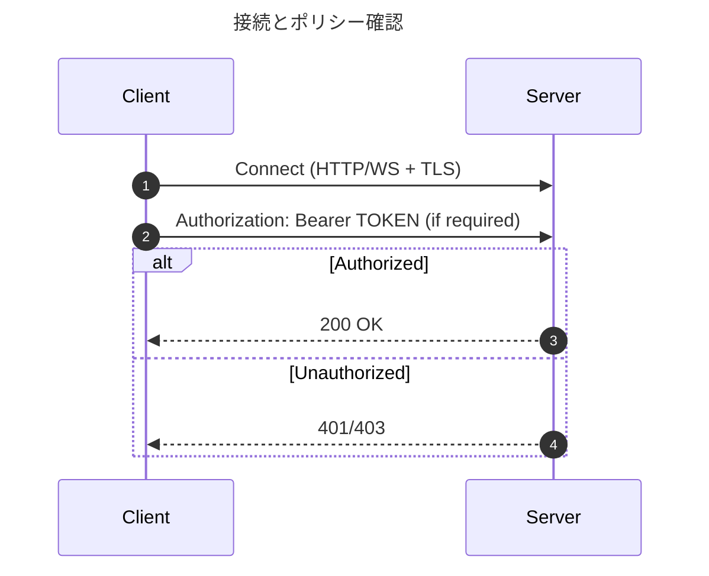
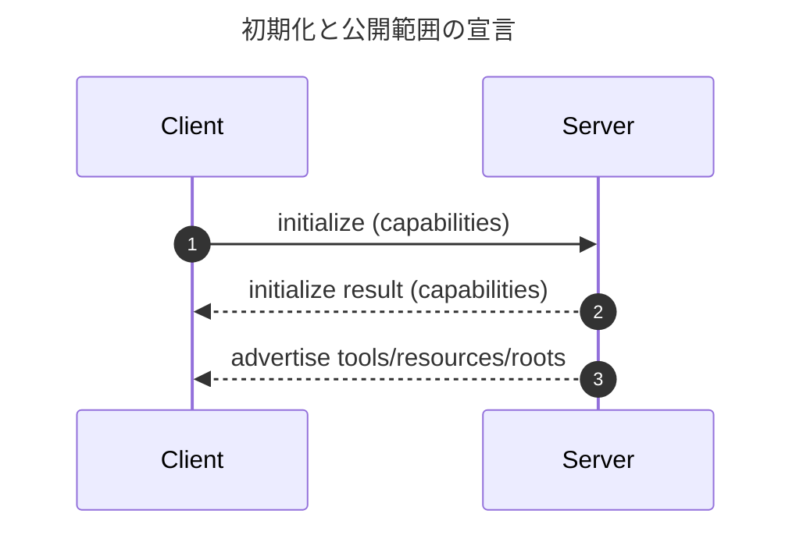
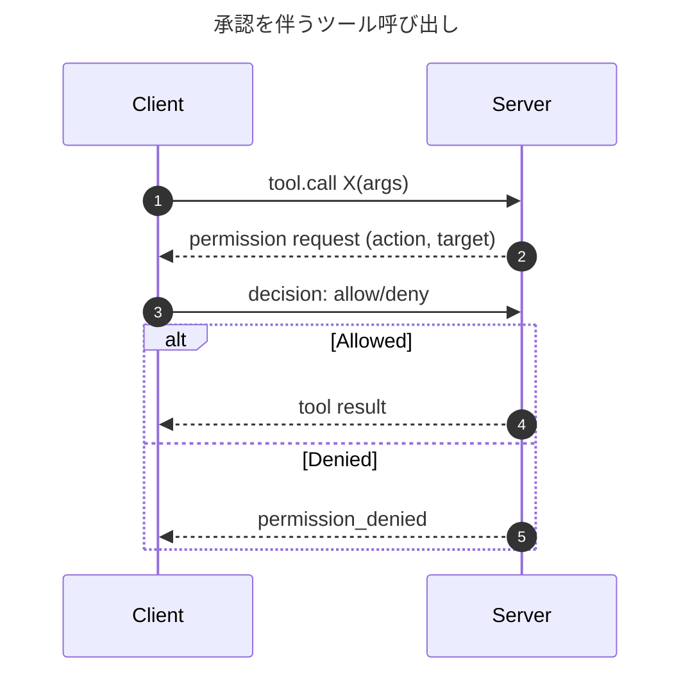
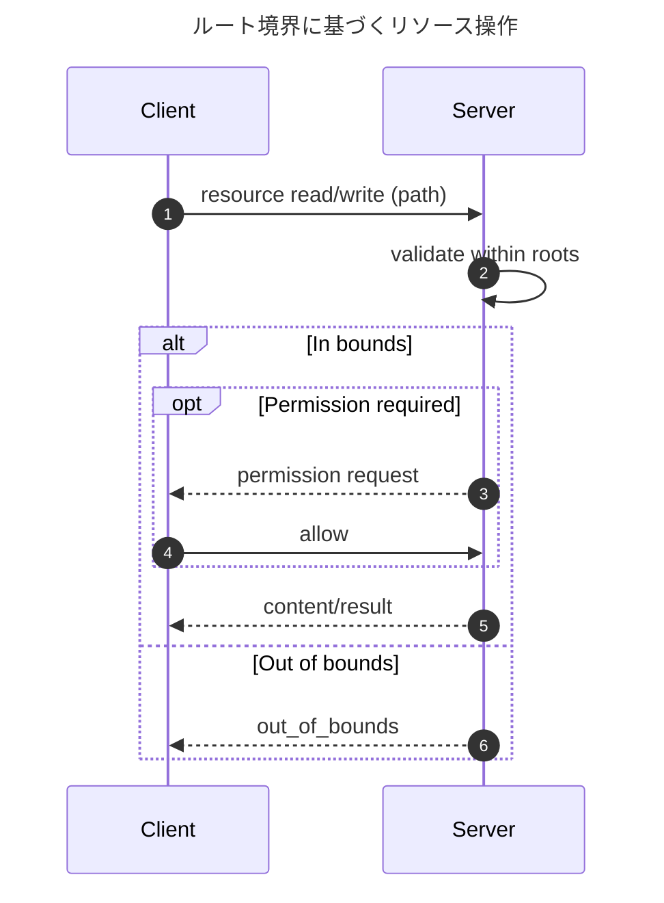
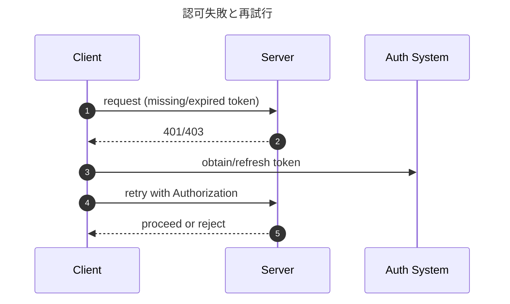

# MCP Authorization — 要点メモ

前提: 本メモは MCP の HTTP/WS トランスポートを想定しています（stdio 等では接続レイヤの OAuth 要件は適用されない場合があります）。

このメモは MCP（Model Context Protocol）のドキュメントにおける「Authorization（認可）」の位置付けと利用方法の要点を整理したものです。引用ではなく要約です。

参照元（一次情報）:
- MCP Basic Spec — Authorization (2025-06-18): https://modelcontextprotocol.io/specification/2025-06-18/basic/authorization

## Authorization Flow（概要）
- 目的: 接続レイヤのアクセス制御（トークン等）と、プロトコル内の実行時承認（Permissions）を組み合わせ、最小権限かつユーザー合意の下で操作を行う。
- 主なフェーズ:
  1) 接続の確立（HTTP/WS/TLS）とトークン提示（必要に応じて）
  2) 初期化での能力交渉（permissions 等の対応有無）と公開範囲の宣言（tools/resources/roots）
  3) 操作リクエスト時の権限確認と、必要ならユーザー承認フローの発火
  4) 実行・監査・結果返却、または拒否
- 責務分離: トークン発行/検証は MCP 外（トランスポート/インフラ側）。操作の承認は MCP の permissions/UI でユーザー同意により制御。

## 主要シーケンス（要約）
- 接続と初期化（HTTP/WS）
  - クライアント→サーバ: 接続確立（TLS 必須推奨）。必要なら `Authorization: Bearer <token>` 等を付与。
  - サーバ→クライアント: 認証/認可ポリシーに従って 200 もしくは 401/403。
  - クライアント↔サーバ: initialize 交換。capabilities（permissions 対応など）と tools/resources/roots を合意。

- 権限が必要なツール呼び出し
  - クライアント→サーバ: tool 呼び出し要求（引数含む）。
  - サーバ→クライアント: 必要なら permission リクエスト（操作名・対象・スコープ・継続性等）。
  - クライアント↔ユーザー: 承認 UI で許可/拒否（「一度のみ」「永続」等の方針）。
  - クライアント→サーバ: 決定を送信。
  - サーバ→クライアント: 許可時は実行結果、拒否時は permission_denied/エラー。

- リソース境界に基づく読み書き
  - クライアント→サーバ: roots/resourceTemplates に沿った read/write 要求。
  - サーバ: パス検証、必要時 permissions、実行。
  - サーバ→クライアント: コンテンツ or out_of_bounds/permission_denied。

- 認可失敗と再試行（HTTP/WS）
  - クライアント→サーバ: 資格情報なし/不正。
  - サーバ→クライアント: 401/403 とポリシー示唆。
  - クライアント: トークン取得/更新（MCP 外）後、再試行。
  - サーバ→クライアント: 成功/失敗。

## 規格準拠とディスカバリ（Standards Compliance / Discovery）
- MCP Server のディスカバリ（必須）
  - MCP servers MUST implement OAuth 2.0 Protected Resource Metadata（RFC 9728）を公開し、利用可能な Authorization Server の場所を示す。
  - 既定の配置: `/.well-known/oauth-protected-resource`（RFC 9728）
  - 最小例（必須項目のみ）:
    ```json
    {
      "resource": "https://mcp.example.com",
      "authorization_servers": [
        "https://auth.example.com"
      ]
    }
    ```
- Authorization Server のディスカバリ
  - MCP clients SHOULD resolve each authorization server’s metadata via OAuth 2.0 Authorization Server Metadata（RFC 8414）
    - 既定の配置例: `/.well-known/oauth-authorization-server` または OpenID Provider Metadata。
- リソース・インジケータ（トークンの宛先指定）
  - MCP clients SHOULD use OAuth 2.0 Resource Indicators（RFC 8707）の `resource` パラメータを用いて、対象の MCP Server 向けにスコープされたアクセストークンを取得。
  - MCP servers MUST verify that presented access tokens are intended for this resource（`resource`/`aud` 等による宛先検証）。
- アクセストークン利用
  - Bearer トークンの提示とエラーハンドリングは RFC 6750（OAuth 2.0 Bearer Token Usage）に準拠すること。
  - 不正/期限切れ時は `WWW-Authenticate: Bearer ...` を含む 401/403 を返すべき（RFC 6750）。

## 主要シーケンス（Mermaid）











## 実装上の勘所（Flow 運用）
- 最小権限の原則: 公開する tools/resources を絞り、書込/外部到達は個別に gating。
- 承認の粒度: 操作、対象（パス/ホスト等）、有効期間（単発/永続）を明示して記録。
- ユーザー体験: 危険操作は明確なラベルと差分表示、覚えさせる/忘れさせるの UI を用意。
- 監査: 承認イベントと実行イベントを双方でロギング。拒否理由をユーザーに可視化。

## 役割別 MUST / SHOULD（要約）
注: 本節の MUST/SHOULD は MCP Authorization の趣旨に沿った実装上の整理です。OAuth 由来の事項には明示的に「(OAuth)」と付記します。前提として、MCP Server は OAuth の保護リソース（Resource Server）、MCP Client は OAuth のクライアント（OAuth Client）です。

- MCP Client
  - MUST: サーバが宣言した capabilities に従い、permissions フローを実装する（承認要求をユーザーに提示し、決定をサーバへ返送）。
  - MUST: サーバが広告した tools/resources/roots の外を実行・参照しない（境界をクライアント側でも強制）。
  - MUST: トランスポートが資格情報を要求する場合は適切な Authorization を送る（例: `Authorization: Bearer <token>`）。
  - MUST (OAuth): Authorization Code + PKCE もしくは Device Authorization を用いてトークンを取得（Implicit は使用しない）。
  - MUST (OAuth): ネイティブ/CLI のリダイレクトは RFC 8252 に準拠（ループバック/カスタムスキーム）。
  - SHOULD: 承認プロンプトで操作・対象・有効期間を明示し、ユーザーの選択に応じた一時/永続ポリシーを適用・永続化。
  - SHOULD: 承認と実行の監査情報を記録し、ユーザーが見直せるようにする。
  - SHOULD NOT: ユーザーの明示同意なく危険操作を自動許可しない。
  - SHOULD: RFC 9728 の Protected Resource Metadata を取得し、列挙された Authorization Server ごとに RFC 8414 メタデータを解決する。
  - SHOULD: トークン取得フローで RFC 8707 の `resource` を指定し、MCP Server 宛のトークンを要求する。

- MCP Server
  - MUST: initialize で公開する tools/resources と roots/resourceTemplates を宣言する。未宣言の操作は受け付けない。
  - MUST: トランスポート方針に従い未認証要求を拒否（例: 401/403）し、承認済み接続のみ処理する。
  - MUST: リソース要求のパスを境界内で検証し、境界外は拒否する。
  - MUST: 機密・破壊的操作には permissions を要求し、クライアントの決定（allow/deny）を尊重する。
  - MUST NOT: 宣言外のリソースへアクセスしたり、承認なしに危険操作を実行したりしない。
  - SHOULD: 最小権限で公開し、レート制御・入力検証・監査ログを実装する。
  - SHOULD: 承認リクエストは対象・範囲・期間を最小化して提示し、わかりやすい文言で説明する。
  - MUST: OAuth 2.0 Protected Resource Metadata（RFC 9728）を実装・公開し、Authorization Server の場所を明示する。
  - MUST: 提示されたアクセストークンが当該リソース向けであることを検証（RFC 8707 等）。
  - SHOULD: Bearer トークンの挑戦/エラーは RFC 6750 の `WWW-Authenticate` を用いて返す。

- Authorization Server / Token Issuer（トランスポート認可。MCPの範囲外、参考）
  - MUST (OAuth): TLS 上でトークンを発行・検証し、期限・失効を管理（RFC 6749/6750）。
  - SHOULD (OAuth): ネイティブ/デスクトップ・クライアントには PKCE を要求し、適切な redirect URI を用いる（RFC 7636/8252）。
  - SHOULD (OAuth): 大量配布時は Dynamic Client Registration を検討し、乱用防止のため初期アクセス・トークンや software_statement を運用（RFC 7591/7592）。
  - MUST (OAuth): Authorization Server Metadata（RFC 8414）を公開し、トークンエンドポイント等を自己記述する。

## 位置付け
- 役割分担: MCP はツール/リソース呼び出しのプロトコルであり、接続レイヤの認証・認可方式自体は規定しません（トランスポート依存）。
- 二層の制御:
  - 接続レイヤ（プロトコル外）: HTTP/WSS などの接続で Authorization（例: Bearer トークン、mTLS 等）を適用。
  - 実行時レイヤ（プロトコル内）: MCP の Permissions/宣言モデルで「何ができるか」を絞り、危険操作にユーザー承認を挟む。

## トランスポートごとの扱い
- stdio（ローカル）: 追加の接続認証は不要になりがち。OS 権限とクライアントの承認 UI に依存。
- HTTP / WebSocket: サーバは接続時に Authorization を要求可能。未認証は 401/403 で拒否し、以後の呼び出しにもトークンを伴わせることを想定。
- TLS: リモート接続では TLS を前提とし、必要に応じてクライアント証明書（mTLS）等も可。

## Permissions（実行時承認）
- 危険/機密操作: ファイル書込、ネットワーク到達、外部コマンド等は「権限リクエスト」をサーバ→クライアントに発行し、ユーザーが承認/拒否。
- 粒度: 操作名、対象パス、スコープ、期間（一時/永続）などでスコープ化可能。
- 能力交渉: 初期ハンドシェイクで双方が permissions 機能の対応を宣言し、以降の承認フローを合意。

## 公開範囲の最小化
- tools/resources の宣言: サーバは提供する操作とリソースを明示し、それ以外は不可。
- ルート境界: `roots`/`resourceTemplates` でアクセス境界を提示。境界外は拒否。

## ベストプラクティス（MCP 運用観点）
- サーバ側: 最小権限で公開、入力検証、レート制御、監査ログ、外部 API への到達にはサーバ内で OAuth 等を完了。
- クライアント側: 危険操作はユーザー承認を義務化、承認ポリシーの可視化と永続化、監査用の記録。
- 接続側: HTTP/WSS では Authorization ヘッダ（例: `Authorization: Bearer <token>`）や mTLS、TLS 強制。

## OAuth との関係
- MCP 自体はトークン発行・検証を扱いません。外部 API へアクセスする際は MCP サーバ内部で OAuth（必要なら DCR、PKCE 等）を完了し、その結果得た能力を MCP のツール/リソースとして公開します。

## まとめ
- 「接続の認可」はトランスポート標準（HTTP/WSS 等）で、「操作の認可」は MCP の Permissions と公開範囲の最小化で行うのが基本設計です。

備考: 本メモは上記 URL の内容に基づき、接続レイヤ（Authorization ヘッダや mTLS 等）と実行時レイヤ（Permissions/公開宣言）の二層での扱いを要約しています。
