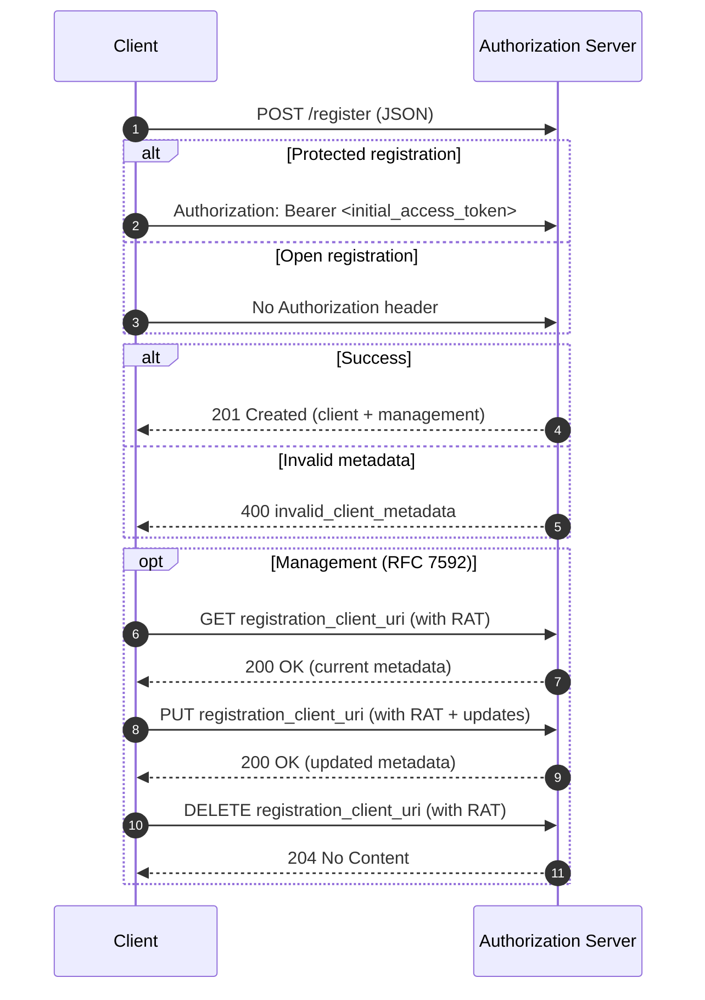

# RFC 7591 Dynamic Client Registration — Sequence

- 注記:
  - 成功レスポンスはサーバポリシーにより `client_secret` を含まない場合があります（公開クライアントや非シークレット認証方式）。
  - `registration_access_token` と `registration_client_uri` によるクライアント構成 API は RFC 7592 に定義されています。
