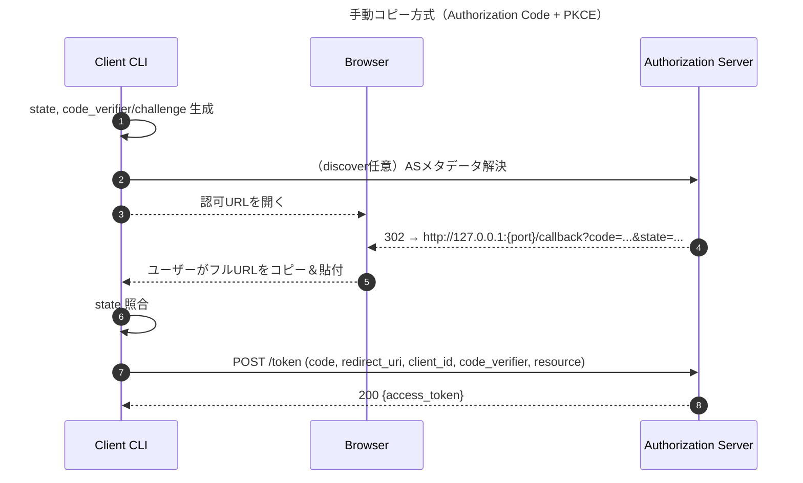

# フロー図（Mermaid）

```mermaid
sequenceDiagram
  title 手動コピー方式（Authorization Code + PKCE）
  autonumber
  participant CL as Client CLI
  participant BR as Browser
  participant AS as Authorization Server

  CL->>CL: state, code_verifier/challenge 生成
  CL->>AS: （discover任意）ASメタデータ解決
  CL-->>BR: 認可URLを開く
  AS-->>BR: 302 → http://127.0.0.1:{port}/callback?code=...&state=...
  BR-->>CL: ユーザーがフルURLをコピー＆貼付
  CL->>CL: state 照合
  CL->>AS: POST /token (code, redirect_uri, client_id, code_verifier, resource)
  AS-->>CL: 200 {access_token}
```
