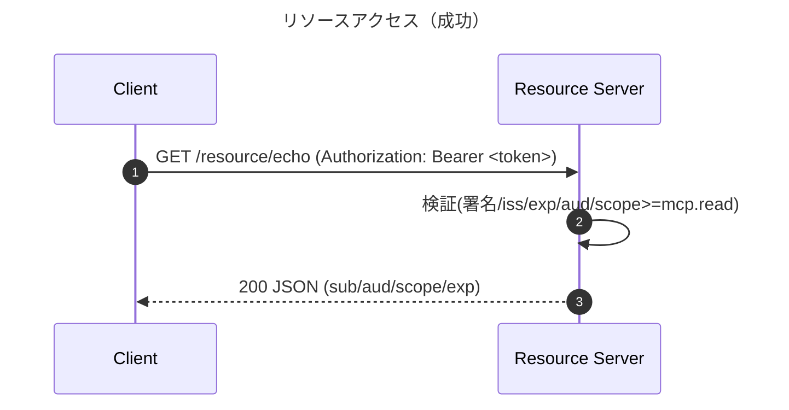
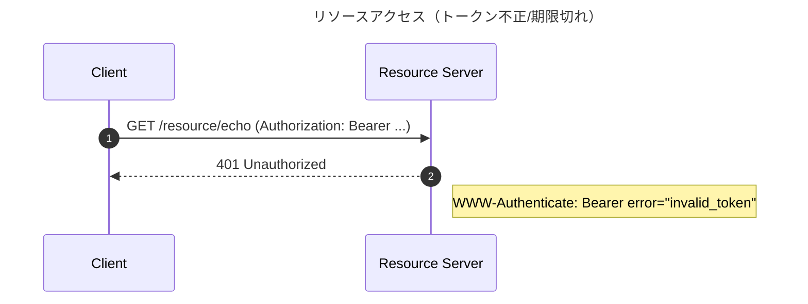
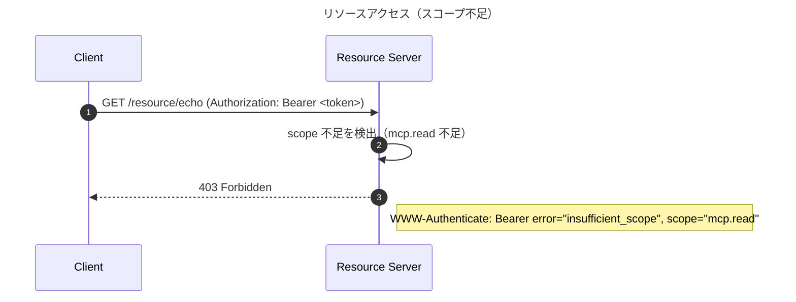

# フロー図（Mermaid）

```mermaid
sequenceDiagram
  title リソースアクセス（成功）
  autonumber
  participant CL as Client
  participant RS as Resource Server

  CL->>RS: GET /resource/echo (Authorization: Bearer <token>)
  RS->>RS: 検証(署名/iss/exp/aud/scope>=mcp.read)
  RS-->>CL: 200 JSON (sub/aud/scope/exp)
```

```mermaid
sequenceDiagram
  title リソースアクセス（トークン不正/期限切れ）
  autonumber
  participant CL as Client
  participant RS as Resource Server

  CL->>RS: GET /resource/echo (Authorization: Bearer ...)
  RS-->>CL: 401 Unauthorized
  Note right of RS: WWW-Authenticate: Bearer error="invalid_token"
```

```mermaid
sequenceDiagram
  title リソースアクセス（スコープ不足）
  autonumber
  participant CL as Client
  participant RS as Resource Server

  CL->>RS: GET /resource/echo (Authorization: Bearer <token>)
  RS->>RS: scope 不足を検出（mcp.read 不足）
  RS-->>CL: 403 Forbidden
  Note right of RS: WWW-Authenticate: Bearer error="insufficient_scope", scope="mcp.read"
```
