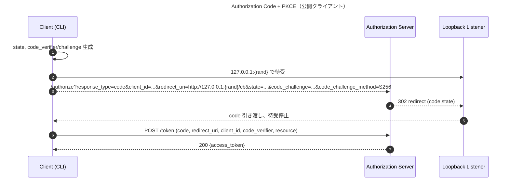
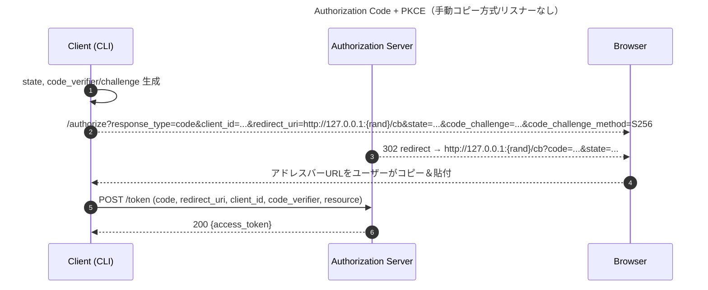

# フロー図（Mermaid）

```mermaid
sequenceDiagram
  title Authorization Code + PKCE（公開クライアント）
  autonumber
  participant C as Client (CLI)
  participant AS as Authorization Server
  participant LP as Loopback Listener

  C->>C: state, code_verifier/challenge 生成
  C->>LP: 127.0.0.1:{rand} で待受
  C-->>AS: /authorize?response_type=code&client_id=...&redirect_uri=http://127.0.0.1:{rand}/cb&state=...&code_challenge=...&code_challenge_method=S256
  AS-->>LP: 302 redirect (code,state)
  LP-->>C: code 引き渡し、待受停止
  C->>AS: POST /token (code, redirect_uri, client_id, code_verifier, resource)
  AS-->>C: 200 {access_token}
```

```mermaid
sequenceDiagram
  title Authorization Code + PKCE（手動コピー方式/リスナーなし）
  autonumber
  participant C as Client (CLI)
  participant AS as Authorization Server
  participant BR as Browser

  C->>C: state, code_verifier/challenge 生成
  C-->>BR: /authorize?response_type=code&client_id=...&redirect_uri=http://127.0.0.1:{rand}/cb&state=...&code_challenge=...&code_challenge_method=S256
  AS-->>BR: 302 redirect → http://127.0.0.1:{rand}/cb?code=...&state=...
  BR-->>C: アドレスバーURLをユーザーがコピー＆貼付
  C->>AS: POST /token (code, redirect_uri, client_id, code_verifier, resource)
  AS-->>C: 200 {access_token}
```

（任意）Device Authorization は必要に応じて別図を参照。
